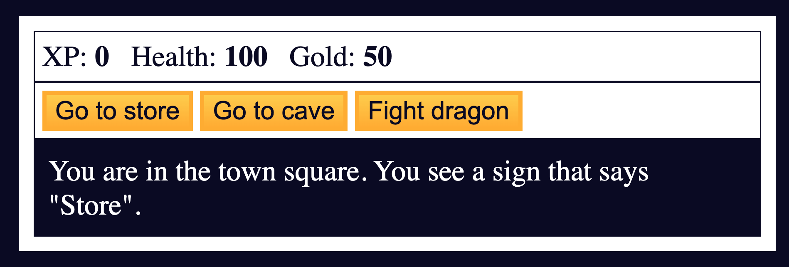

# freeCodeCamp - RPG - Dragon Repeller

This is a project in the [Learn Basic JavaScript Algorithms and Data Structures](https://www.freecodecamp.org/news/learn-javascript-with-new-data-structures-and-algorithms-certification-projects/).

## Table of contents 😌

- [Overview](#overview)
  - [The project](#the-project)
  - [Screenshot](#screenshot)
  - [Links](#links)
- [My process](#my-process)
  - [Built with](#built-with)
  - [What I learned](#what-i-learned)
  - [Continued development](#continued-development)
  - [Code snippets](#im-really-proud-of-these-code-snippets%EF%B8%8F)
  - [Useful resources](#useful-resources)
- [Author](#author)

## Overview👋🏾

Welcome to the first project of the course! While I already earned my certification, I thought it would be fun to go through the course again since its just been revamped. You can now learn JavaScript by building 21 projects, and I will be detailing each one 😊.

### The project😥

In this project users will be able to:

- Demonstrate understanding of arrays, strings, objects, functions, loops, if/else statements, and more.

### Screenshot🌇



### Links👩🏾‍💻

- Solution URL: (https://github.com/MaianneThornton/RPGDragonRepeller)
- Live Site URL: (https://maianne-rpgdragonrepeller.netlify.app/)

## My process💭

I started by marking out initial classes and IDs in the html file to be later used for styling. Next I began styling the css to begin building the visuals.  I added functionality by way of JavaScript to create game-play.

In this game, users can teleport to various locations, purchase weapons and health, and battle multiple monsters with increasing difficulty.

I also hid an easter egg in the game which turns out to be a game itself. Can you find it?

### Built with👷🏾‍♀️

- Semantic HTML5 markup
- CSS custom properties
- JavaScript

### What I learned👩🏾‍🏫

This project was a review of basic JavaScript methods. I was able to refresh my memory and practice accessing data in arrays and objects, if else statements, loops, accessing and updating the DOM, and methods such as .pop, .shift, and Math.random.

### Continued development🔮

In the future I plan on continuing to practice using different selectors to be more precise when select elements.

I also plan on continuing to learn the best ways to phrase git commits, so that future viewers can fully understand the changes that have occurred.

### I'm really proud of these code snippets✂️

```js
function pick(guess) {
  const numbers = []
  while (numbers.length < 10) {
    numbers.push(Math.floor(Math.random() * 11));
    text.innerText = "You picked " + guess + ". Here are the random numbers:\n";
    for (let i = 0; i < 10; i++) {
      text.innerText += numbers[i] + "\n";
    }
    if (numbers.indexOf(guess) !== -1) {
      text.innerText += "Right! You win 20 gold!";
      gold += 20;
      goldText.innerText = gold;
    } else {
      text.innerText += "Wrong! You lose 10 health!";
      health -= 10;
      healthText.innerText = health;
      if (health <= 0) {
        lose();
      }
    }
  }
};
```

### Useful resources📖

- [Resource](https://www.freecodecamp.org/news/learn-javascript-with-new-data-structures-and-algorithms-certification-projects/) - This is an amazing article which details the updated freeCodeCamp curriculum.
- [Resource](https://www.freecodecamp.org/news/how-to-write-better-git-commit-messages/) - This is an amazing article which helped me write better commit messages. I'd recommend it to anyone still learning this concept.

## Author🔎

- Website - [Portfolio Site](https://maiannethornton.netlify.app/)
- Frontend Mentor - [@MaianneThornton](https://www.frontendmentor.io/profile/MaianneThornton)
- GitHub - [@MaianneThornton](GitHub.com/MaianneThornton)
- X (formerly Twitter) - [@MaianneThornton](https://twitter.com/MaianneThornton)
- LinkedIn - [@MaianneThornton](https://www.linkedin.com/in/maiannethornton/)
